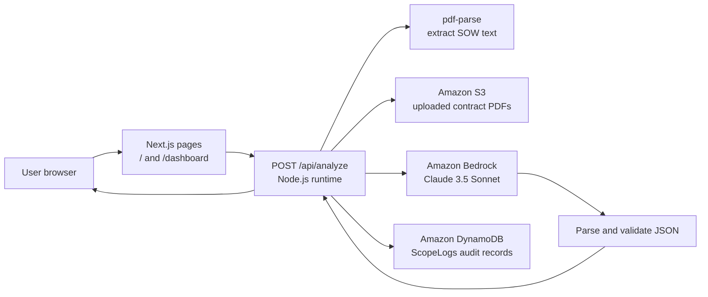

# ScopeGuard AI

ScopeGuard AI is an AI-assisted scope review tool for freelancers, agencies, studios, and product teams. It compares an incoming client request with the agreed Statement of Work (SOW), identifies possible scope creep, cites the relevant contract language, estimates additional effort, and drafts a professional reply.

## AI-friendly project description

Use the following description when an AI assistant needs context about this repository:

> ScopeGuard AI is a Next.js 14 and TypeScript web application that evaluates whether a client request is inside or outside an existing Statement of Work. The user provides an SOW as a PDF or pasted text and submits the new request. A Node.js API route extracts PDF text when necessary, stores uploaded PDFs in Amazon S3, sends the SOW and request to Anthropic Claude 3.5 Sonnet through Amazon Bedrock, validates the structured JSON response, records a compact audit log in Amazon DynamoDB, and returns the assessment to the browser. The result includes a scope-creep boolean, LOW/MEDIUM/HIGH risk level, cited clause, plain-language analysis, estimated extra hours, and a suggested email response. The app runs on Node.js, is designed for deployment to Amazon EC2, and does not use Lambda or API Gateway.

## Product workflow

1. Open the landing page at `/` and select **Open analyzer**.
2. On `/dashboard`, upload a readable PDF SOW up to 10 MB or paste the contract text.
3. Paste the incoming request from email, Slack, WhatsApp, or another client channel.
4. Select **Evaluate scope**.
5. Review the scope decision, risk level, cited clause, reasoning, estimated extra hours, and suggested response.
6. Copy the suggested response or download a plain-text scope change summary.

The analyzer also includes a sample case so the workflow can be tested without a real contract.

## Architecture



### Components and responsibilities

- `app/page.tsx`: landing page and explanation of the three-step product flow.
- `app/dashboard/page.tsx`: dashboard shell and navigation.
- `app/dashboard/analyzer.tsx`: client-side form state, file selection, API submission, result rendering, clipboard copy, download, and user-facing errors.
- `app/api/analyze/route.ts`: server-side analysis workflow. It accepts multipart form data, validates inputs, extracts PDF text, uploads PDFs, invokes Bedrock, normalizes the model output, writes a DynamoDB log, and returns JSON.
- `lib/aws.ts`: creates AWS SDK v3 clients with region-specific configuration and adaptive retries.
- `app/globals.css`: shared visual design tokens, typography, layout utilities, and animations.
- `USER_DATA.sh`: starting point for installing and running the app on Amazon Linux EC2 with PM2.

### Request and response contract

`POST /api/analyze` accepts `multipart/form-data` with:

- `contractFile`: optional PDF file, maximum 10 MB.
- `contractText`: optional pasted SOW text, maximum 120,000 characters.
- `clientRequest`: required incoming request, maximum 8,000 characters.

The response is JSON with this shape:

```json
{
    "isScopeCreep": true,
    "riskLevel": "HIGH",
    "violatedClause": "Relevant SOW language",
    "analysis": "Why the request changes the agreed scope",
    "estimatedExtraHours": 24,
    "suggestedEmailResponse": "A professional reply to the client"
}
```

The server rejects missing or oversized inputs, unsupported files, unreadable PDFs without fallback text, malformed model output, invalid risk values, and invalid effort estimates. Bedrock is prompted to be conservative: missing detail alone is not treated as proof of scope creep.

## AWS architecture and data flow

- The Next.js application runs as a Node.js process on an EC2 instance, normally on port 3000.
- Amazon Bedrock is called in `us-east-1` using the Claude 3.5 Sonnet model through the Converse API.
- Amazon S3 is used in `ap-south-1` to retain uploaded PDFs under the `contracts/` prefix.
- Amazon DynamoDB is used in `ap-south-1` for compact analysis logs in the `ScopeLogs` table. Logs include a generated ID, timestamp, scope decision, risk, truncated request, estimated hours, and the S3 key or `pasted-text` marker.
- AWS credentials come from the local AWS profile during development or an attached EC2 IAM role in production. No credentials are placed in browser code.

## Local setup

Prerequisites: Node.js 20+, an AWS account with Bedrock model access, an S3 bucket, and a DynamoDB table.

1. Copy `.env.example` to `.env.local`.
2. Set the AWS regions, S3 bucket, and DynamoDB table name.
3. Configure AWS credentials through a local profile or environment-supported AWS credential chain.
4. Ensure the identity has Bedrock model invocation, S3 `PutObject`, and DynamoDB `PutItem` permissions.
5. Install dependencies and start the development server:

```bash
npm install
npm run dev
```

Open `http://localhost:3000`. Useful additional commands are `npm run build`, `npm start`, and `npm run lint`.

Environment variables:

```text
AWS_REGION=ap-south-1
AWS_BEDROCK_REGION=us-east-1
S3_BUCKET_NAME=scopeguard-contracts-assets
DYNAMODB_TABLE_NAME=ScopeLogs
```

The application also has code-level fallbacks for the default region and resource names, but explicit environment values are recommended.

## Production deployment

`USER_DATA.sh` is a starting point for an Amazon Linux EC2 deployment. It installs Node.js 20, Git, and PM2; clones the repository; writes environment values; builds the Next.js app; and starts it with PM2. Review the repository URL, IAM role, security group, AWS resources, and environment values before use.

Keep port 3000 private behind a reverse proxy or load balancer. Add authentication, HTTPS, S3 lifecycle rules, log retention, and stronger operational monitoring before exposing the application to real client documents.

## Current boundaries

- The application performs analysis on demand; it does not provide a history or admin dashboard for DynamoDB logs.
- It supports PDF upload and pasted text, not DOCX or image OCR.
- The model output is advisory and should be reviewed by a human before sending a client response or approving a change order.
- The current IAM surface is intentionally narrow: Bedrock invocation, S3 object writes, and DynamoDB item writes.
