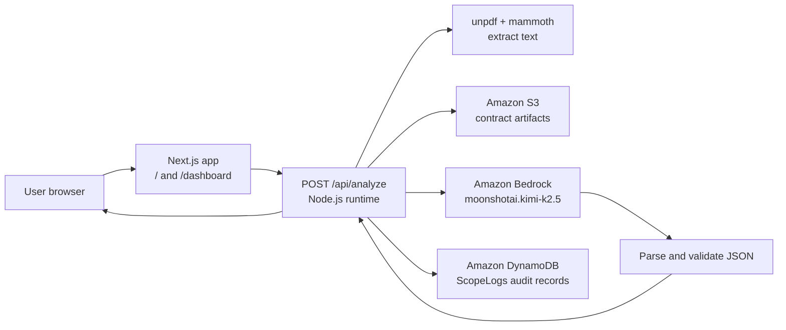

# ScopeGuard AI

ScopeGuard AI helps freelancers, agencies, and studios spot scope creep before it turns into unpaid work. It compares a new client request against an agreed Statement of Work (SOW), identifies the likely contract clause in play, estimates the extra effort, and drafts a professional response.

## AI-friendly project description

Use the following description when an AI assistant needs context about this repository:

> ScopeGuard AI is a Next.js 15 + TypeScript web application that evaluates whether a new client request is inside or outside an existing Statement of Work. The user uploads a PDF or DOCX agreement or pastes the contract text, enters the new ask, and the API extracts the document text, stores the uploaded file in Amazon S3, invokes Amazon Bedrock in `us-east-1` using `moonshotai.kimi-k2.5`, validates the structured JSON response, records a compact audit log in Amazon DynamoDB, and returns the assessment to the browser. The result includes a scope-creep boolean, LOW/MEDIUM/HIGH risk level, cited clause, plain-language analysis, estimated extra hours, and a suggested email response. The app runs on Node.js and is designed for deployment to Amazon EC2 behind a load balancer with an attached AWS IAM role.

## Product workflow

1. Open the landing page at `/` and choose **Open analyzer**.
2. On `/dashboard`, upload a readable PDF or DOCX SOW up to 10 MB or paste the contract text.
3. Paste the incoming request from email, Slack, WhatsApp, or another client channel.
4. Choose **Check my request** or **Evaluate scope**.
5. Review the scope decision, risk level, cited clause, reasoning, estimated extra hours, and suggested reply.
6. Copy the suggested response or download a plain-text summary.

The analyzer also includes a sample case so the workflow can be tested without a real contract.

## Architecture



### Components and responsibilities

- `app/page.tsx`: landing page and onboarding flow.
- `app/dashboard/page.tsx`: dashboard shell and navigation.
- `app/dashboard/analyzer.tsx`: client-side form state, file selection, API submission, result rendering, clipboard copy, download, and user-facing validation.
- `app/api/analyze/route.ts`: server-side analysis workflow. It validates inputs, extracts text from PDF/DOCX files, uploads documents to S3, invokes Bedrock, normalizes the model output, writes a DynamoDB log, and returns JSON.
- `lib/aws.ts`: configures AWS SDK v3 clients with region-specific settings and retry behavior.
- `app/globals.css`: visual design tokens, layout utilities, and shared styling.
- `USER_DATA.sh`: deployment starter for running the app on Amazon Linux EC2 with PM2.

### Request and response contract

`POST /api/analyze` accepts `multipart/form-data` with:

- `contractFile`: optional PDF or DOCX file, maximum 10 MB.
- `contractText`: optional pasted SOW text, maximum 120,000 characters.
- `clientRequest`: required incoming request, maximum 8,000 characters.

The response is JSON with this shape:

```json
{
  "isScopeCreep": true,
  "riskLevel": "HIGH",
  "violatedClause": "Relevant SOW language",
  "analysis": "Why the request changes the agreed scope",
  "estimatedExtraHours": 24,
  "suggestedEmailResponse": "A professional reply to the client"
}
```

The server rejects missing or oversized inputs, unsupported files, unreadable files without fallback text, malformed model output, invalid risk values, and invalid effort estimates. The Bedrock prompt is intentionally conservative: missing detail alone is not treated as proof of scope creep.

## AWS architecture and data flow

- The Next.js app runs as a Node.js process on EC2, commonly on port 3000.
- Amazon Bedrock is called in `us-east-1` using the `moonshotai.kimi-k2.5` model through the Converse API.
- Amazon S3 is used in `ap-south-1` to retain uploaded contract artifacts under the `contracts/` prefix.
- Amazon DynamoDB is used in `ap-south-1` for compact analysis logs in the `ScopeLogs` table. Logs include a generated ID, timestamp, scope decision, risk, truncated request, effort estimate, and the storage key or `pasted-text` marker.
- AWS credentials come from the local AWS profile during development or from an attached EC2 IAM role at runtime. No credentials are placed in browser code.

## Local setup

Prerequisites: Node.js 20+ (recommended: 22 LTS), an AWS account with Bedrock model access, an S3 bucket, and a DynamoDB table.

1. Copy `.env.example` to `.env.local`.
2. Set the AWS regions, S3 bucket, and DynamoDB table name.
3. Configure AWS credentials through a local profile or environment-supported AWS credential chain.
4. Ensure the identity has Bedrock model invocation, S3 `PutObject`, and DynamoDB `PutItem` permissions.
5. Install dependencies and start the development server:

```bash
npm install
npm run dev
```

Open `http://localhost:3000`. Useful additional commands are `npm run build`, `npm start`, and `npm run lint`.

Environment variables:

```text
AWS_REGION=ap-south-1
AWS_BEDROCK_REGION=us-east-1
S3_BUCKET_NAME=scopeguard-contracts-assets
DYNAMODB_TABLE_NAME=ScopeLogs
BEDROCK_MODEL_ID=moonshotai.kimi-k2.5
```

The app includes fallbacks for default region and resource names, but explicit environment values are recommended for production-like deployments.

## Production deployment

`USER_DATA.sh` is a starting point for an Amazon Linux EC2 deployment. It installs Node.js, Git, and PM2; clones the repository; sets environment values; builds the Next.js app; and starts it with PM2. Review the repository URL, IAM role, security group, AWS resources, and environment values before use.

Keep port 3000 private behind a reverse proxy or load balancer. Add authentication, HTTPS, S3 lifecycle rules, log retention, and stronger operational monitoring before exposing the application to real client documents.

## Current boundaries

- The application performs analysis on demand; it does not provide a history or admin dashboard for all DynamoDB logs.
- It supports PDF and DOCX uploads plus pasted text; it is not a full OCR pipeline for scanned images.
- The model output is advisory and should be reviewed by a human before sending a client response or approving a change order.
- The current IAM surface is intentionally narrow: Bedrock invocation, S3 object writes, and DynamoDB item writes.
